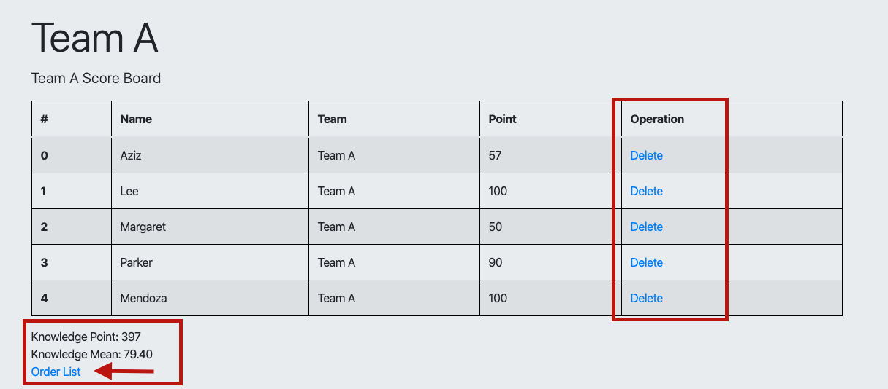
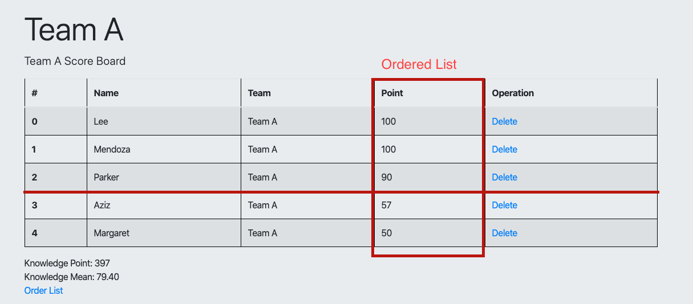

# Lesson 3
https://vuejs.org/v2/guide/computed.html

In-template expressions are very convenient, but they are meant for simple operations. Putting too much logic in your templates can make them bloated and hard to maintain. For example:

```html
<div id="example">
  {{ message.split('').reverse().join('') }}
</div>
```

At this point, the template is no longer simple and declarative. You have to look at it for a second before realizing that it displays message in reverse. **The problem is made worse when you want to include the reversed message in your template more than once.**

That’s why for any complex logic, **you should use a computed property.**

```html
<div id="example">
  <p>Original message: "{{ message }}"</p>
  <p>Computed reversed message: "{{ reversedMessage }}"</p>
</div>
```
the method should be declared in computed key and it will call like callback function.

```javascript
var vm = new Vue({
  el: '#example',
  data: {
    message: 'Hello'
  },
  computed: {
    // a computed getter
    reversedMessage: function () {
      // `this` points to the vm instance
      return this.message.split('').reverse().join('')
    }
  }
})
```

## Order List in JS
```javascript
methods: {
    orderedItems() {
        this.member_list = this.member_list.sort(
            (a,b) => (parseInt(a.score) > parseInt(b.score)) ? -1:1);
    }
}
```

## Example Picture



## Todo 
- If score less than mean change color as red.
- If score bigger than mean change color as green.